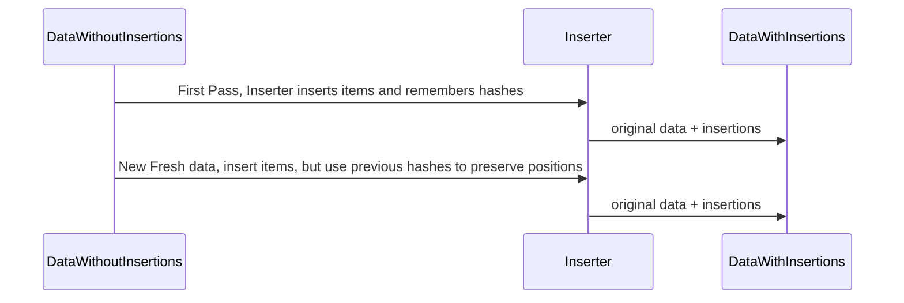

# ListInserter


# What is it?

ListInserter facilitates inserting items into a sectioned or non-sectioned list of items. Although designed with SwiftUI and UIKit via diffable data sources in mind, it can insert into any type in a list.

It is fairly typical for apps to have a list of data they receive from an API endpoint, or a data source such as CoreData. If we then have the requirement that we would like to decorate the existing items with new items, this can involve some tedious boilerplate code that involves ensuring items remain in bounds, adding custom view types for SwiftUI or UIKit, and specific logic for to prevent inserted items from jumping when items are deleted. What we really want, is to be able to describe how we want to insert an item, and for something else to handle that boilerplate logic. Enter ListInserter.

## Use case

To illustrate with a contrived example, imagine we have 5 books coming from an API endpoint, and we want to add a promotional item third from the top:

`["fantasy1", "fantasy2", "horror1", "fantasy3", "horror2"]`

should become

`["fantasy1", "fantasy2", "horror1", "promotional view", "fantasy3", "horror2"]`

To do this, we might define our items as such:

```swift
struct BookItem: Hashable, ValueKindIdentifiable {
    
    enum Details: Hashable {
        case fantasy(String)
        case horror(String, Int)
    }
    
    enum Kind: Hashable {
        case fantasy
        case horror
    }
        
    let id = UUID() // allows duplicate entries of the exact same item
    let valueKind: Kind
    let details: Details
    
    init(_ details: Details) {
        self.details = details
        self.valueKind = Kind(details)
    }
}
```

To use the ListInserter, we would need to conform to a protocol, and map our items to a wrapper type.

```swift
// ListInserter compatible item
struct BookItem: Hashable, ValueKindIdentifiable {
    
    enum Details: Hashable {
        case fantasy(String)
        case horror(String, Int)
    }
    
    enum Kind: Hashable {
        case fantasy
        case horror
    }
        
    let id = UUID() // allows duplicate entries of the exact same item
    let valueKind: Kind
    let details: Details
    
    init(_ details: Details) {
        self.details = details
        self.valueKind = Kind(details)
    }
}
```

And instead of an array of `BookItem`s, we need to convert our `[BookItem]` to `[Item<BookItem>]`.

```swift
let bookItems: [BookItem] = [...] // original data source
let inserterItems = bookItems.map { .value($0) }
```

Which then allows us to apply insertions with a ListInserter (using a NoSections type):

```swift
struct PromotionalView: View { ...code... }

typealias Inserter = ListInserter.Inserter<NoSection<BookItem, PromotionalView>>
typealias Item = ListInserter.Item<BookItem, PromotionalView>

let injectThreeFromTop = TestInserter.InsertionRequest(
    requestType: .index(
        .init(embed: PromotionalView(),
            position: .top(3))))

let listInserter = MyInserter(itemInsertionRequests: [injectThreeFromTop])

let itemsWithInsertions = listInserter.insert(into: items) // Feed into UI
```

With a few lines of code, we are able to describe how we want to insert an item, have the inserter insert the item, and render out the items.

See the included example app for more details.

# Features
- Ability to insert items in non-sectioned or sectioned data.
- Ability to insert items based on index or near a kind of item.
- Ability to have 0..n inserters, with the ability to turn enable/disable all inserters, or individual inserters.
- Ability to delete items and have inserted items not jump around.

# Diagram

